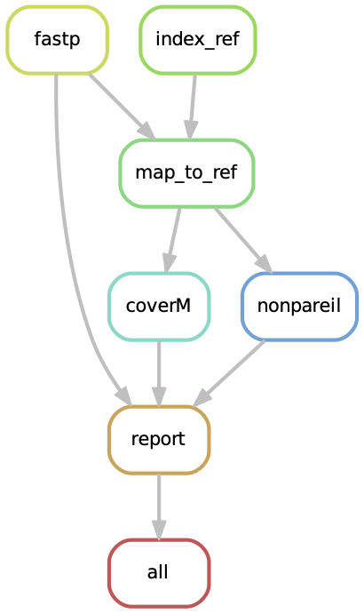
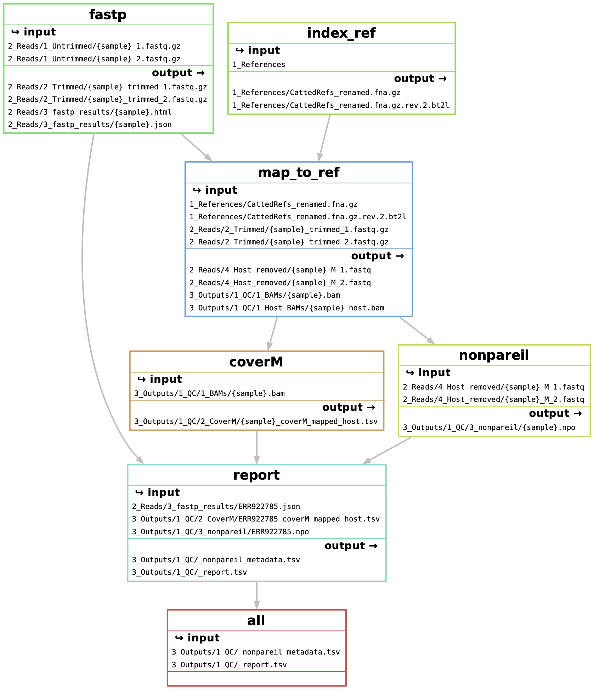

# EHI_bioinformatics
Bioinformatics pipeline to process EHI data

### General information:
This pipeline uses snakemake, and manages dependencies using conda (or mamba) for reproducibility and deployability. The 0_Code directory contains the snakefiles, scripts, and conda environment yamls. 

## Getting started:
Firstly, you'll want to clone this directory to the system where you want to run the analyses:
```
git clone https://github.com/anttonalberdi/EHI_bioinformatics.git
```

## Preprocessing pipeline (1_Preprocess_QC.snakefile)
*updated 23/06/2022, Raphael Eisenhofer*

### What this pipeline does:
This step of the pipeline quality filters (including adapter trimming, polyX tail removal) metagenomic reads using fastp (0.23.1). Host genomes are indexed using BowTie2 (2.4.4), before the fastp-filtered reads being mapped to the host genome/s using BowTie2 (default settings). Nonpareil (3.4.1) is then run on the host-filtered reads to estimate metagenome diversity and assembly coverage. CoverM (0.6.1) is run on the host-mapped BAMs to calculate the read counts against the host genome/s. Finally, the summary statistics of the preprocessing and host mapping are collated into a final report.

Here is a simplified DAG (directed acyclic graph) of the above steps:



### Usage:
Currently, the snakefile searches for .fastq.gz files located in this path (assuming you are launching the snakefile from the current directory):
```
2_Reads/1_Untrimmed/*_1.fastq.gz
```
Therefore, you'll need to put your reads in this directory (note that the fastq file suffixes should be **'_1.fastq.gz'** and **'_2.fastq.gz'**).

Next, you'll need to put your host reference genome/s in the following directory:
```
1_References/
```
Note that the host reference genome/s need to be gzip compressed -- **'.gz'** suffix (default when downloading from NCBI). 

That's all the setup required to get the pipeline running. Now you just need to launch the snakefile using snakemake. How you do this depends on your HPC server job queueing system. For Computerome 2.0, I use the following one liner (can be called directly from your terminal):
```
snakemake \
-s 0_Code/1_Preprocess_QC.snakefile \
-j 30 \
--cluster "qsub -A ku-cbd -W group_list=ku-cbd -l nodes=1:thinnode:ppn={threads},mem={resources.mem_gb}G,walltime=00:08:00:00" \
--use-conda \
--conda-frontend conda  \
--conda-prefix /home/projects/ku-cbd/people/rapeis/0_Software/CONDA \
--latency-wait 600
```
I've written the pipeline such that it loads the required conda environments from a shared directory (no need to install the environment each time you run it), and handles the requesting of optimised resources (RAM/CPUs) for each job based on the specific snakemake rule.

Here's a illustrative summary of each rule and it's input files and output files:


